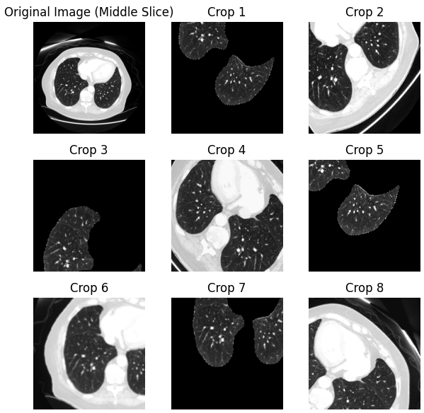
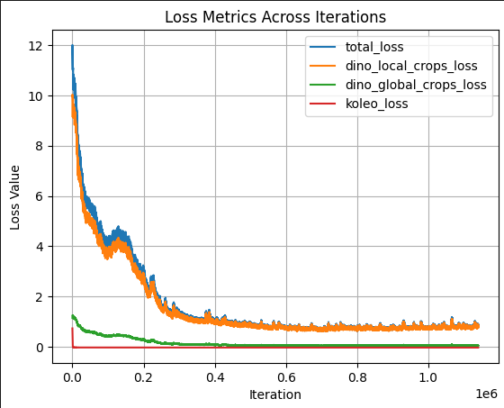

# DINOv2-CT: Self-Supervised Learning for CT Scans

This project adapts [DINOv2](https://github.com/facebookresearch/dinov2) for self-supervised learning on CT (Computed Tomography) scans with two key modifications:

• **CT Medical Imaging Support**: Processes 3-slice medical imaging data with innovative custom augmentation strategies

• **Kubernetes Deployment**: Migrated from SLURM to Kubernetes using torchrun for distributed training

## Overview

DINOv2-CT extends the original DINOv2 framework to work with CT scan data, specifically designed for medical imaging applications. The project includes custom dataset loaders, data preprocessing for Hounsfield Units (HU), and Kubernetes deployment configurations for distributed training.

## Key Modifications

### 1. CT Dataset Implementation (`dinov2/data/datasets/ct_net.py`)

The main adaptation is the `CTDataset` class that handles CT scan data:

- **Data Format**: Loads NPZ files containing CT scan arrays and masks
- **Hounsfield Unit (HU) Normalization**: 
  - Clips values to medical standard range: -1000 to 150 HU
  - This range covers typical CT scan values (air: -1000 HU, bone: 150+ HU) 
- **Multi-channel Input**: Combines image data and mask data as separate channels
- **Patch Size**: Configurable 3D patch size (default: 512×512×6) - first 3 slices are CT data, last 3 slices are lung mask data, saved as .npz and loaded 
- **Error Handling**: Graceful fallback to default images when loading fails

```python
# HU normalization in ct_net.py
vmin, vmax, eps = -1000., 150., 0.00005
image_data = np.clip(image_data, vmin, vmax)
image_data = np.clip((image_data - vmin) / (vmax-vmin), eps, 1-eps)
```

### 2. Extended Vision Dataset (`dinov2/data/datasets/extended.py`)

Modified the base dataset class to:
- Handle tensor data directly (not just PIL images)
- Support 3D medical imaging data
- Implement proper error handling and logging

### 3. Migration from SLURM to torchrun

The project has been adapted from SLURM-based distributed training to Kubernetes with torchrun:

#### Original SLURM Approach:
```bash
python dinov2/run/train/train.py \
    --nodes 4 \
    --config-file dinov2/configs/train/vitl16_short.yaml \
    --output-dir <PATH/TO/OUTPUT/DIR>
```

#### New torchrun Approach:
```bash
torchrun --nproc_per_node=8 \
    --nnodes=2 \
    --node_rank=0 \
    --master_addr="master-pod-ip" \
    --master_port=29500 \
    dinov2/run/train/train_torchrun.py \
    --config-file dinov2/configs/train/vitl16_short.yaml \
    --output-dir <PATH/TO/OUTPUT/DIR>
```

#### Key Changes:
- **`train_torchrun.py`**: New training script that uses torchrun environment variables instead of submitit
- **Environment Variables**: Uses `NODE_RANK`, `WORLD_SIZE`, `RANK` from torchrun
- **Kubernetes Integration**: Headless services for pod-to-pod communication
- **Multi-node Support**: StatefulSet-based deployment for reliable pod startup

## Data Preparation

### CT Scan Data Format

The dataset expects NPZ files with the following structure:
```python
{
    "array": np.ndarray,  # CT scan data (3D array)
    "mask": np.ndarray    # Corresponding mask data
}
```

### Data Augmentation and Multi-Crop Strategy

The DINOv2 framework uses a multi-crop augmentation strategy where the student model receives 8 different views of the same CT scan:



The augmentation includes:
- **Standard Crops (Crops 2, 4, 6, 8)**: Regular spatial crops showing different regions of the CT scan (using first 3 slices)
- **Masked Crops (Crops 1, 3, 5, 7)**: Crops with lung segmentation masks applied, isolating lung parenchyma and pulmonary vessels (using last 3 slices)
- **Multi-channel Input**: Combines original CT data (first 3 slices) with mask data (last 3 slices) for enhanced feature learning

### Data Path Configuration

Update the dataset path in your configuration:
```yaml
# In config files
dataset_path: CTDataset:npz_dir_path=/path/to/npz/files:patch_size=512,512,6
```

## Training

### Training Progress

The training shows typical self-supervised learning behavior with rapid initial convergence followed by fine-tuning:



The loss curves demonstrate:
- **Total Loss**: Rapid decrease from ~12 to ~0.5 over 200k iterations, then stabilization
- **DINO Local Crops Loss**: Primary contributor to total loss, closely tracking the total loss
- **DINO Global Crops Loss**: Smaller contribution, stabilizing near zero
- **KoLeo Loss**: Minimal contribution throughout training


#### Multiple GPUs Configuration Details

The `multiple_GPUs.yaml` file is configured for:
- **8 GPUs per node** (`nproc_per_node=8`)
- **Single node** (`nnodes=1`)
- **DGX A100 GPUs** with CUDA 12
- **20GB shared memory** for efficient GPU communication
- **Persistent volume mounts** for data and home directories

Key environment variables:
- `MASTER_ADDR`: Automatically set to pod IP
- `MASTER_PORT`: 29500 (standard PyTorch distributed port)
- `NCCL_DEBUG`: INFO level logging for debugging
- `NCCL_SOCKET_IFNAME`: eth0 network interface
- `NCCL_IB_DISABLE`: 1 (disables Infiniband if not available)

#### Customizing the Configuration

To modify the configuration for your setup:

1. **Change GPU count**: Update `nproc_per_node` and `nvidia.com/gpu` limits
2. **Update paths**: Modify volume mounts and working directory
3. **Change user**: Update `runAsUser`, `runAsGroup`, and `fsGroup`
4. **Select GPU type**: Modify `nvidia.com/gpu.machine` node selector

Example for 4 GPUs:
```yaml
args: [
  "--nproc_per_node=8",  
  # ... other args
]
resources:
  limits:
    nvidia.com/gpu: "8" 
  requests:
    nvidia.com/gpu: "8"
```

### Configuration Files

- `dinov2/configs/train/vitl16_short.yaml`: Short training configuration
- `dinov2/configs/train/vitl14.yaml`: Full ViT-L/14 training
- `dinov2/configs/ssl_default_config.yaml`: Default SSL configuration

## Hounsfield Units (HU) Processing

Our normalization maps this range to [0, 1] for neural network training:
- Clips values to [-1000, 150] HU range
- Normalizes to [0, 1] with epsilon clipping to avoid numerical issues

## Kubernetes Deployment

### Prerequisites

- Kubernetes cluster with GPU support
- NVIDIA GPU operator installed
- Persistent volumes for data storage

### GPU Node Selection

The deployment supports different GPU types:
```yaml
nodeSelector:
  nvidia.com/gpu.runtime.major: "12"
  "nvidia.com/gpu.present": "true"
  "nvidia.com/gpu.machine": "DGXA100-920-23687-2530-000"  # or "DGXH100"
```

### Multi-Node Setup

1. **Headless Service**: Enables pod-to-pod communication
2. **StatefulSet**: Ensures ordered pod startup
3. **DNS Resolution**: Pods can find each other via service names

## File Structure

```
dinov2-ct/
├── dinov2/
│   ├── data/datasets/
│   │   ├── ct_net.py          # CT dataset implementation
│   │   ├── extended.py        # Extended vision dataset
│   │   └── decoders.py        # Data decoders
│   ├── run/train/
│   │   ├── train_torchrun.py  # torchrun training script
│   │   └── train.py           # Original SLURM script
│   └── configs/
│       ├── train/             # Training configurations
│       └── eval/              # Evaluation configurations
├── k8s-run/                   # Kubernetes deployment files
│   └── multiple_GPUs.yaml
├── 1_train.py                 # Main training script
└── README.md
```

## Dependencies

- PyTorch 2.0+
- CUDA 11.7+
- xFormers 0.0.18
- mmcv-full 1.5.0
- mmsegmentation 0.27.0
- numpy < 2.0

## Usage Examples

### Basic Training
```bash
kubectl apply -f k8s-run/multiple_GPUs.yaml
kubectl logs -f msalehjahromi-torchrun6-test -n yn-gpu-workload
```

### Custom Dataset Path
```bash
python dinov2/run/train/train_torchrun.py \
    --config-file dinov2/configs/train/vitl16_short.yaml \
    --output-dir ./output \
    train.dataset_path=CTDataset:npz_dir_path=/path/to/data:patch_size=512,512,6
```

### Multi-GPU Training
```bash
torchrun --nproc_per_node=4 dinov2/run/train/train_torchrun.py \
    --config-file dinov2/configs/train/vitl16_short.yaml \
    --output-dir ./output
```

## Model Visualization

### Attention Map Analysis

The trained model's attention patterns can be visualized to understand what features it focuses on:


The attention visualization shows:
- **12 Different Attention Heads**: Different heads learn to attend to various aspects of the CT scan anatomy
- **Anatomical Specialization**: Head 9 focuses on lung interior, Heads 10-11 detect nodules/tumors, Head 6 identifies heart structures


## Contributing

 ...
 
## License

 ...

### Quick Start

**Single Node Multi-GPU (Recommended):**
```bash
kubectl apply -f k8s-run/multiple_GPUs.yaml
kubectl logs -f msalehjahromi-torchrun6-test -n yn-gpu-workload
```

**Multi-Node (Kubernetes):**
```bash
kubectl apply -f k8s-run/headless-service.yaml
kubectl apply -f k8s-run/multi_node_job_service_first.yaml
kubectl logs -f <pod-name> -n yn-gpu-workload
```

**Single Node (Local):**
```bash
python 1_train.py
```
